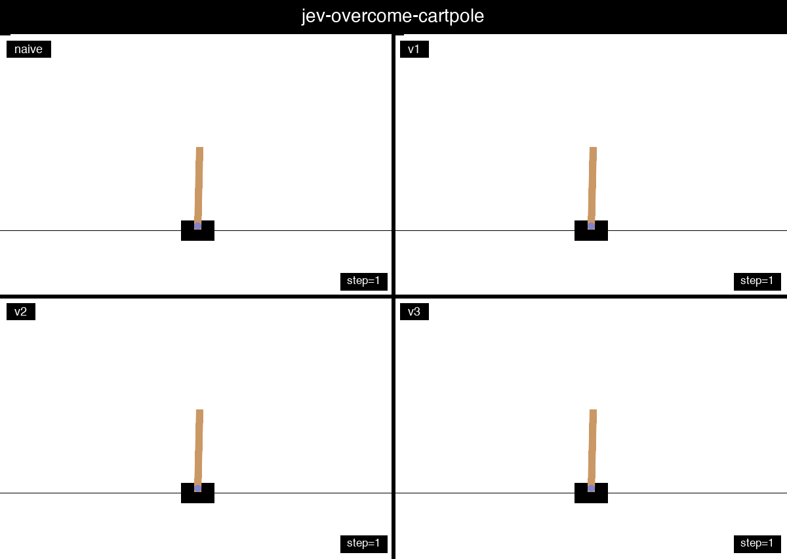

# Teaching Jev to Survive CartPole: From a Naive Prompt to 500 Steps

This project is a small prompt-engineering study: can a general-purpose decision
model control Gymnasium's `CartPole-v1` environment if the state description and
control instructions are improved step by step?

The answer is yes. Starting with a minimal prompt, the agent was refined through
three versions. In a representative experiment, the final version, v3,
completed the full 500-step CartPole episode.

The agents are in [`./`](/):

- [`naive_jev_cartpole_agent.py`](jev-overcome-cartpole/naive_jev_cartpole_agent.py)
- [`jev_cartpole_agent_v1.py`](jev-overcome-cartpole/jev_cartpole_agent_v1.py)
- [`jev_cartpole_agent_v2.py`](jev-overcome-cartpole/jev_cartpole_agent_v2.py)
- [`jev_cartpole_agent_v3.py`](jev-overcome-cartpole/jev_cartpole_agent_v3.py)

## The decision interface: TypeSafe Noul

Each environment step sends the current state to TypeSafe's official System One
endpoint. The agent asks one binary `noul` question: should the next action be
`push_right`?

The returned probability is converted into a CartPole action:

- `noul >= 0.5` → `push_right` / action `1`
- `noul < 0.5` → `push_left` / action `0`

## The baseline: naive

The naive agent follows the minimal CartPole prompt inspired by the
[`jev_deep_rl`](https://github.com/taodav/jev_deep_rl/) CartPole task. Its state
contains the environment, the goal, the current step, and a named observation:

```json
{
  "environment": "CartPole-v1",
  "goal": "Keep the pole upright and the cart on the track for as long as possible.",
  "step": 12,
  "observation": {
    "cart_position_m": 0.15,
    "cart_velocity_m_per_s": -0.42,
    "pole_angle_deg": 4.8,
    "pole_angular_velocity_deg_per_s": 18.1
  }
}
```

Naming the four physical quantities is important, but the baseline does not give
Jev a detailed control policy. It must infer how a force, velocity, angle, and
angular velocity interact from the current observation alone.

## v1: tell the model to think dynamically

The first change was qualitative rather than mathematical. v1 explicitly tells
Jev to:

1. Predict the next few states before choosing an action.
2. Consider cart position, cart velocity, pole angle, and pole angular velocity.
3. Account for gravity, acceleration, and inertia.
4. Correct before the cart or pole reaches a failure boundary.
5. Prioritize an imminent pole-angle failure over perfect cart centering.
6. Avoid rapidly switching directions because of tiny observation changes.

The state format and API stayed unchanged. Only the control instructions became
more explicit. This distinction matters: the model was not given a simulator or
a controller; it was given a clearer description of the reasoning that a useful
controller should perform.

## v2: remove ambiguity about directions and priorities

v2 adds concrete semantics that are easy to get wrong in CartPole:

- action `0` means `push_left`, and action `1` means `push_right`;
- positive cart position and velocity point right;
- a positive pole angle means the pole leans right;
- positive angular velocity means that rightward lean is increasing;
- when the pole leans right, pushing right is the default way to move the cart
  underneath it, and vice versa.

It also gives Jev explicit safety zones:

- hard failure at approximately ±2.4 meters or ±12 degrees;
- early-warning zones at approximately ±1.8 meters or ±6.9 degrees;
- CartPole-v1 truncates the episode at 500 steps.

Finally, v2 establishes a priority order: first prevent pole-angle failure, then
prevent cart-position failure, then reduce angle and angular velocity, and only
then move the cart smoothly toward the center.

This turns a vague goal—“keep the pole upright”—into a sequence of decisions
that reflects the actual risk structure of the environment.

## v3: add a short-horizon prediction model

v1 already told Jev to predict. v3 makes that request more operational by
describing the environment time scale and giving approximate trend equations:

```text
predicted_cart_position ≈ cart_position
                         + 0.02 × cart_velocity

predicted_pole_angle ≈ pole_angle
                       + 0.02 × pole_angular_velocity
```

These are deliberately presented as early-warning estimates rather than exact
CartPole dynamics. Jev is asked to compare `push_left` and `push_right` over the
next few steps and choose the action whose predicted trend moves away from the
nearest failure boundary.

The prompt also explains a useful sign pattern:

- angle and angular velocity with the same sign means the pole is still falling
  in that direction, so correction is urgent;
- opposite signs mean the pole is recovering, so an aggressive reversal may
  overcorrect it.

The model therefore receives just enough structure to reason about momentum and
delayed effects without requiring a full physics implementation in the prompt.

## What changed—and what did not

The progression deliberately changed one conceptual layer at a time:

| Version | Main addition |
| --- | --- |
| naive | Current named observation and minimal action question |
| v1 | Qualitative dynamics, prediction, early correction, and anti-chatter guidance |
| v2 | Direction conventions, numeric safety zones, and control priorities |
| v3 | Short-horizon time scale, trend estimates, and angle/velocity sign reasoning |

Across all versions, the action space, Noul output mapping, official TypeSafe
interface, and Gymnasium environment remained the same. This makes the versions
useful as a prompt ablation sequence rather than as unrelated agents.

## Results

For one comparable evaluation, the CartPole environment was initialized with
`seed=7` and run for at most 500 steps. The observed results were:

| Agent | Reward / steps |
| --- | ---: |
| naive | 19 |
| v1 | 13 |
| v2 | 199 |
| v3 | **500** |

The environment seed controls the initial state, but it does not make the
experiment deterministic. Jev's API decisions are stochastic, so repeated runs
can produce different trajectories and scores even with the same environment
seed. The table is therefore one observed outcome, not a deterministic
benchmark. The important result is that v3 has demonstrated complete CartPole
survival, while the earlier prompts usually failed much sooner.

## Running the experiment

Install the dependencies:

```bash
cd jev-overcome-cartpole
python3 -m venv .venv
source .venv/bin/activate
python3 -m pip install -r requirements.txt
```

Set the TypeSafe key without committing it to the repository:

```bash
export TYPESAFE_API_KEY="your TypeSafe API key"
```

Run any version with the same experimental settings:

```bash
python3 naive_jev_cartpole_agent.py --episodes 1 --max-steps 500 --seed 7
python3 jev_cartpole_agent_v1.py --episodes 1 --max-steps 500 --seed 7
python3 jev_cartpole_agent_v2.py --episodes 1 --max-steps 500 --seed 7
python3 jev_cartpole_agent_v3.py --episodes 1 --max-steps 500 --seed 7
```

The project also includes API-independent tests:

```bash
python3 -m unittest discover -s tests -v
```

## Takeaway

The biggest improvement did not come from adding a longer conversation history.
It came from making the control problem legible: name the physical variables,
define the signs and failure boundaries, state the safety priorities, and ask for
a short-horizon prediction. By v3, Jev has a compact qualitative model of what
each action is likely to do next—and that is enough to turn a naive action guess
into a controller that can complete CartPole.
